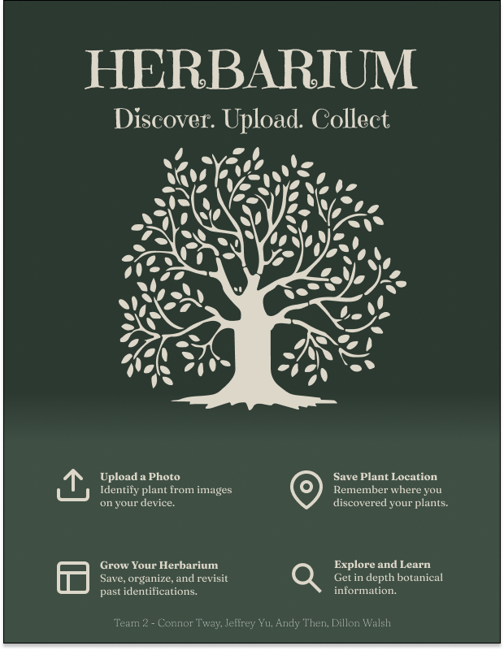

## Update
This project was done as part of the CS491 Software Engineering course at Pace University, Spring 2025. Content related to the Scrum and other Agile Methodologies were removed for seucrity and privacy reasons. Addtionally, .git was removed because sensitive information was committed to source control.

# TEAM 2

## App name
Herbarium

## Team Members
Dillon Walsh, Jeffrey Yu, Connor Tway, Andy Then

## Scrum Master
Jeffrey Yu

## Product Owner
Andy Then  

## App description
Herbarium is a web application that enables users to document and track plants they encounter in the wild. With a user-friendly interface, it allows individuals to upload photos of plants, which are then analyzed and classified using a machine learning algorithm trained on a diverse plant database. Users can log their discoveries, view details about each species, and contribute to a growing community-driven plant collection. An interactive map feature highlights plant sightings around the world, fostering global awareness and collaboration in plant identification and biodiversity tracking.

## Architecture & Design
[Architecture & Design](https://www.figma.com/design/5CbQvP2CI7SNkvK4FV66FQ/HERBARIUM?node-id=1-2&p=f)

## Process

## Tools & APIs
* [Google Maps Platform](https://mapsplatform.google.com/)
* [Firebase](https://firebase.google.com/)
* [Google Cloud Run](https://cloud.google.com/run)
* [Vite](https://vite.dev/)
* [Bootstrap](https://getbootstrap.com/)
* [React](https://react.dev/)
* [Pl@ntNet API](https://my.plantnet.org/)
* [Perenual](https://perenual.com/docs/api)
## Final delivery

* [Poster](images/herb.png)
